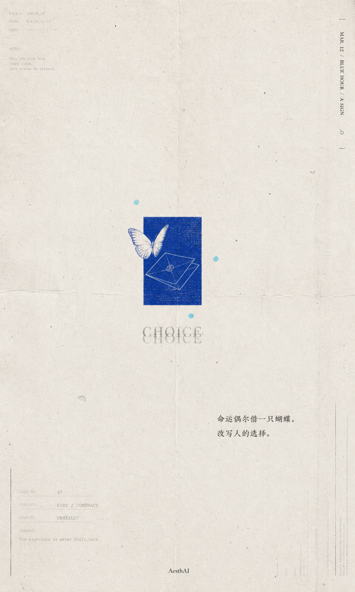
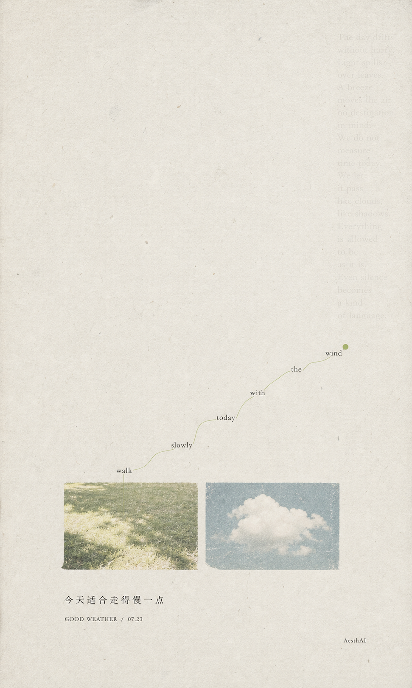

# GC Still Image Motion Director

**English** · [简体中文](README.zh-CN.md)

A Codex skill that analyzes a real still image, decides whether it should use motion, micro-motion, or remain static, and writes a restrained image-to-video prompt without breaking typography, paper texture, framing, or layout.

The callable skill name is `gc-still-image-motion-director`.

This skill writes motion direction and a copy-ready prompt. It does not generate the final video.

## What It Does

The skill:

- reads the actual image before proposing motion;
- separates visible observations from recommendations;
- selects at most one primary action and one physically related response;
- explicitly locks text, numbers, paper, frames, grids, and composition;
- supports `motion`, `micro-motion`, and `static` decisions;
- adapts the final prompt to a named image-to-video platform when requested;
- diagnoses text, paper, camera, and layout drift in failed results.

It avoids stock effects such as automatic camera push-ins, floating layers, breathing paper, generic particles, and unsupported parallax.

## Examples

These two supplied cases show the intended difference between `motion` and `micro-motion`.

For each case, the user supplied the source image and asked Codex to use this Skill. Codex inspected the image and generated the Chinese Seedance 2.0 prompt shown below; that prompt was then used with Seedance 2.0 to generate the linked result clip. The clips are real outputs from those runs. Generative results can vary, and a returned take may not obey every lock perfectly.

### `motion` — CHOICE



The butterfly stays in its original focal region and completes one bounded wingbeat. The blue rectangle, envelope drawing, typography, Chinese copy, paper texture, and full composition remain fixed.

[Watch the 4-second MP4 result](examples/choice-butterfly.mp4)

The source was a verified Apple Live Photo pair. This repository uses a silent MP4 derivative for browser compatibility and does not publish the Live Photo package.

<details>
<summary>Seedance 2.0 prompt used for this result (Chinese)</summary>

```text
固定镜头，保持原图构图、纸张质感和全部排版完全不变。

只让蓝色矩形左上方现有的白色线稿蝴蝶缓慢完成一次振翅：双翼从当前展开状态向内收拢约8至10度，再平稳展开回到原始角度。蝴蝶身体和落点基本不动，整体位移不超过蓝色矩形宽度的1%，最后完全停稳。

蓝色矩形、信封线稿、信封折线、中央火漆印、三个浅蓝圆点、CHOICE及其倒影、中文“命运偶尔借一只蝴蝶，改写人的选择。”、四周日期、编号、档案文字、边线、折痕、污点和纸张纹理全部固定。

禁止蝴蝶飞走、持续扇翅、增加或减少翅膀，禁止蝴蝶复制或变形成真实昆虫，禁止信封打开、移动或变形，禁止火漆印旋转，禁止圆点漂浮，禁止文字变化、纸张呼吸和镜头移动。
4秒，先停留约0.6秒，只完成一次缓慢振翅，最后恢复静止。
```

</details>

### `micro-motion` — Walk Slowly



Motion remains inside the two photo windows: light and grass shift subtly in the left image while the cloud changes gently in the right image. The path text, Chinese title, paper texture, spacing, and full layout remain fixed.

[Watch the 4-second MP4 result](examples/walk-slowly.mp4)

<details>
<summary>Seedance 2.0 prompt used for this result (Chinese)</summary>

```text
固定镜头，完整保持原图的纵向海报构图、留白和编辑排版。

前1秒画面保持静止。随后只让右侧云朵照片框内部的白云缓慢向右漂移，位移不超过该照片框宽度的3%，云朵形状、体积和边缘保持稳定，不生成新的云朵。

同时，左侧草地照片框内部受到同一阵轻微微风影响，少量草叶只摆动2–3度，斑驳阳光在草地表面产生非常缓慢、细微的明暗变化。所有动态必须严格限制在两个矩形照片框内部，最后1秒逐渐稳定下来。

绿色曲线、绿色圆点、“walk slowly today with the wind”全部单词、右侧浅灰英文诗句、中文标题、日期、署名、照片框边界、旧纸颜色、纸张纤维、颗粒、污点和大面积留白完全固定。

禁止文字改写、字母闪烁、绿色曲线变形、圆点移动、照片框漂移或变形；禁止云朵快速移动、翻滚或新增；禁止草地大幅摇晃；禁止纸张呼吸、纹理漂浮、全画面曝光变化、镜头推近、平移、缩放、旋转、景深变化和视差。

4秒，极度克制、安静，像一阵微风只经过照片里的草地和云，海报本身始终保持静止。
```

</details>

## Installation

Clone the public repository directly into the Codex skills directory:

```bash
git clone https://github.com/LiamGvchi/gc-still-image-motion-director.git \
  ~/.codex/skills/gc-still-image-motion-director
```

Restart Codex if the skill does not appear immediately.

## Usage

Invoke the skill with a still image:

```text
用 $gc-still-image-motion-director 分析这张海报应该怎么动，
锁住文字和纸张，并给我一条可复制的图生视频 Prompt。
```

For a folder of images:

```text
用 $gc-still-image-motion-director 分析这个图片文件夹，
分别判断哪些适合动、哪些只适合微动、哪些应该保持静止。
```

To repair a failed result:

```text
用 $gc-still-image-motion-director 重写这条 Prompt：
上一版出现了文字变化、纸张呼吸和镜头漂移。
```

## Output

For each image, the skill can return:

1. visible image observations;
2. a `motion`, `micro-motion`, or `static` decision;
3. one bounded primary action and an optional linked response;
4. an explicit lock list;
5. a copy-ready image-to-video prompt;
6. the main predicted failure risks.

The default is a restrained 4-second clip when no platform or duration is specified.

## Repository Structure

- `SKILL.md`: the core workflow and output contract
- `references/motion-decision-framework.md`: motion suitability, amplitude, timing, and composition rules
- `references/prompt-construction.md`: prompt order, lock lists, negative constraints, and repair guidance
- `agents/openai.yaml`: Codex UI metadata
- `evals/evals.json`: representative trigger and non-trigger cases
- `examples/`: two supplied still-and-result pairs demonstrating `motion` and `micro-motion`
- `LICENSE`: MIT license

This repository publishes one standalone skill. It does not include private backups, unrelated user media, platform credentials, or claims that the Skill itself generated the example videos.

## Compatibility Notice

This project is independent and is not affiliated with or endorsed by Jimeng or any image-to-video platform. Product names are used only to describe compatibility.

Platform behavior may change. The skill does not claim undocumented controls and falls back to a platform-neutral prompt when behavior is uncertain.

## Related Skill

For quiet minimal zine-style poster generation, see [GC Minimal Zine Poster](https://github.com/LiamGvchi/gc-minimal-zine-poster).

## License

MIT. See `LICENSE`.
