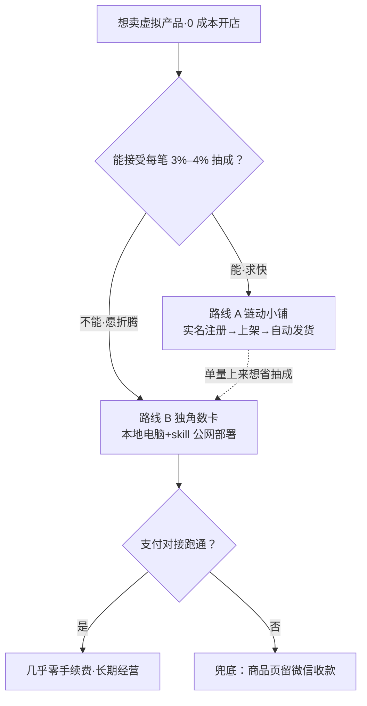

# 【建议收藏】0成本搭建一个自己的网络小店

> bilibili · UP 主 小宇Boi · 时长 3:38 · [原片](https://www.bilibili.com/video/BV14tTj6CEuM) · 总结于 2026-10-08

## TL;DR

不用服务器、不用写代码，也能搭一个能收款、能自动发货的网店卖虚拟产品。视频给出两条 0 成本路线：**链动小铺**——托管平台，实名认证即可开店，零门槛零维护，代价是每笔 3%–4% 服务费；**独角数卡**——开源自建，要自己搞定服务器、域名和支付对接，跑通之后几乎零手续费且店铺完全归你。UP 主还开源了一个把本地电脑变成公网服务器的 skill，让自建路线的电费网费就是全部成本，并用独角数卡实测卖了一个月虚拟产品（订单总数 89、已支付 77 笔、支付成功率 86.62%）。

评论区对这个玩法的态度相当务实：实用性获得认可（UP 主晒出了真实经营数据），但税务、备案、平台保证金三个合规问题被反复追问——UP 主对税务的回应是"赚到钱了再去考虑"，且已有观众照做搭店出货变现。开场弹幕打卡以"没开过店"为主，这是一期面向零基础观众的实操教程。

**你能带走什么**

- **学到**：
  1. 两条 0 成本路线的本质差异——托管平台用 3%–4% 抽成换零维护，开源自建用部署与支付对接的折腾换长期零手续费与完整所有权；
  2. "0 成本服务器"的可行解：开源 skill 把本地电脑（如 Mac mini）变成公网服务器、Docker 部署，成本只剩电费网费；
  3. 自动发货网店的真正门槛在支付对接，跑不通时"商品页留联系方式、微信收款"是可接受的兜底。
- **做到**：
  - 零基础验证需求：照官方文档注册链动小铺，上架一个虚拟商品——完成标准：收到第一笔自动发货订单；
  - 长期经营：Docker 部署独角数卡 + UP 主的 skill 公网穿透 + 自配支付渠道——完成标准：1 分钱测试商品全流程购买成功；
  - 选路线：按"预估单量 × 客单价 × 3%"估算一年的服务费支出——完成标准：得出一个具体金额数字，并据此定下走托管还是自建。
- **如果只做一件事**：到 UP 主两个店各花 1 分钱下一单测试商品，体验完整的自动购买-发货流程，再决定走哪条路线。
- **适合谁 / 不适合谁**：适合想卖资料包等虚拟产品、零基础起步、愿意为一台旧电脑和支付对接折腾的人；不适合指望平台自带流量、或不想处理税务与商户资质的人。

## 逐段详解

> 原片无官方章节，以下为按主题划分。

两条路线怎么选，一图看懂：

### [00:00–00:13] 开场承诺

开场直接给出结果承诺：不用服务器、不用写代码，零成本搭建一个能收款、能自动发货的网络小店。适用对象是想卖资料包或各类虚拟产品的观众，跟着视频一步步做即可快速搭建。

### [00:13–00:51] 两条路线总览

- **路线 A · 链动小铺**（原字幕『练度小铺』，可能是链动小铺）：用别人的平台，不需要域名和服务器，实名认证之后就能使用，但每笔交易抽 3%–4% 服务费，适合前期零成本开店。
- **路线 B · 独角数卡**：开源程序自建平台，需要自己提供服务器和域名，并对接自己的支付宝账号；搭好后网站完全属于你，没有中间商抽成，还支持自定义域名。配合 UP 主提供的 skill，这条路也能接近零成本。

两条路线怎么选：

| 维度 | 链动小铺（托管） | 独角数卡（自建） |
|------|------------------|------------------|
| 前置条件 | 实名认证即可 | 服务器/本地电脑 + 域名 + 支付对接 |
| 交易成本 | 每笔 3%–4% 服务费 | 跑通后几乎零手续费 |
| 所有权 | 平台托管 | 网站完全归你、可自定义域名 |
| 技术难度 | 零（照官方文档注册） | 要跑通部署与支付（可求助 AI） |
| 适合阶段 | 零成本起步、快速验证 | 长期经营、单量上来后省抽成 |

两条路线不互斥，收款与自动发货的逻辑一致，可以从 A 迁到 B。两条路线的详细图文教程都放在了评论区。

### [00:51–01:44] 路线 A：链动小铺（零难度起步）

UP 主先声明本期视频没有接任何广告。注册环节不需要演示——官方提供了非常详细的注册文档，照着走就能快速开店，支持支付宝和微信支付。

**免费但有代价**：每笔交易额外收 3%–4% 服务费；商品单价高、利润薄时，这 3% 足以劝退卖家。文档里虽提到"自配支付渠道"，但 UP 主联系客服得到的明确答复是现在不支持了——想绕开服务费，此路不通。

后台配置相当丰富：电脑手机端均可访问、多种店铺样式主题，买家付款后可通过微信或邮箱收到通知；卖家可查看订单、添加优惠券、设置分销系统。

一句话评价：功能非常齐全的开店方式，就看能不能承受那 3% 服务费。

> "反正小雨是受不了"（『小雨』为字幕笔误，即 UP 主小宇Boi 自称）

### [01:44–03:15] 路线 B：独角数卡（自建，重点）

这是 UP 主自己正在用的方式。独角数卡是 GitHub 上热度非常高的开源项目，官方文档详细；懒得看文档可以直接丢给 AI 让它解释。

**控制台仪表盘可以看非常详细的交易数据和成交量。**UP 主为做这期视频专门卖了一个月虚拟产品实测：画面显示订单总数 89（已支付订单 77）、支付金额 8085.00 CNY、支付成功率 86.62%、总成本 4860.00 CNY、总利润 810.00 CNY、利润率 14.29%、新增用户 43、上架商品 2、自动交付可用卡密 200、统计周期 05/17–06/15。注意口播说明"总利润"不准——很多商品没填成本，未计入计算。地址栏显示 `http://192.168.31.44:8096`，印证了 UP 主"没买服务器、部署在本地电脑"的说法。

**怎么零成本部署**：开源程序需要部署到服务器上；UP 主前几天开源了一个 skill，可以把本地电脑变成公网服务器——建议在 Docker 里用这个 skill 部署，就能让别人访问，详细做法在其另一期视频。UP 主自己的店没买服务器，搭建在 Mac mini 上（原字幕『Mac米以上』，可能是 Mac mini），成本只有电费和网费。

**功能一览**：订单管理非常详细，支持查看对方 IP 地址；支付渠道可配置非常多——支付宝、PayPal、加密货币等都可以。难点在支付要自己跑通，以前比较困难，现在有 AI 可以多问；跑通之后几乎零手续费。用户管理支持会员等级、优惠券、推广返利；系统设置里还有大量配置项。

**跑不通支付的兜底**：在商品最下方留联系方式，让买家直接微信付款，也是一种不错的选择。UP 主演示了具体做法：在商品简介栏写上微信号引导买家添加。

### [03:15–03:31] 收尾与资源

UP 主在两个网站都添加了 1 分钱测试商品，有需求的观众可以花 1 分钱测试购买流程看看效果；两个网站的详细图文教程都已写好，遇到问题可到 UP 主的社群讨论。

## 延伸

**线索与资源**

- 链动小铺官网：ldxp.cn
- 独角数卡：GitHub 高热度开源项目（帧上产品名为 Dujiao-Next，github.com/dujiao-next）
- UP 主开源的 skill：本地电脑变公网服务器（其另一期视频有详细教程）
- 完整图文教程：B 站后台私信 UP 主"开店"获取；UP 主社群可答疑
- 两个店的 1 分钱测试商品：可实测完整购买-发货流程

**视频没讲 / 未回答**

- 税务与经营主体：有观众问"要不要开个体工商户"，UP 主回应"赚到钱了再考虑"——动手前建议自查或咨询专业人士；
- 平台合规：有观众反映链动小铺注册要交保证金（视频未提及，以官方为准）；个人备案能否上线支付网站、支付宝等渠道对商户主体资质的要求，视频均未展开——视频方案走本地电脑 + 隧道而非国内服务器，服务器备案大概率不在路径上，但支付渠道合规仍是动手前要自查的部分。

**QA**（先遮住答案自问，再对照）

Q：两条路线各自付出的"成本"是什么？
A：托管（链动小铺）用每笔 3%–4% 抽成换零维护；自建（独角数卡）用部署与支付对接的折腾换长期零手续费与完整所有权。

Q：不买服务器，UP 主怎么让独角数卡被公网访问？
A：用其开源的 skill 把本地电脑（Mac mini）变成公网服务器，在 Docker 里部署。

Q：支付渠道跑不通时的兜底方案是什么？
A：商品页最下方留联系方式，让买家直接微信付款。
